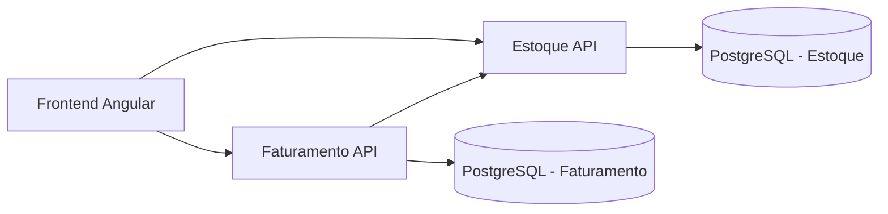

# Arquitetura

## Visao geral

O projeto segue arquitetura de microsservicos com separacao de responsabilidades por dominio:

- Estoque: produtos e baixa de saldo.
- Faturamento: notas fiscais, impressao e fechamento.
- Frontend: interface para operacao dos fluxos.
- Shared: contratos comuns entre servicos.

## Componentes

### 1. Korp.Estoque.Api

Responsavel por:

- CRUD de produtos.
- Processamento de baixa de estoque por lote de itens.
- Controle de concorrencia por token de versao.

Pontos tecnicos:

- EF Core + Npgsql.
- `VersaoConcorrencia` configurado como `IsConcurrencyToken`.
- Validacoes via DataAnnotations nos DTOs.

Arquivo de referencia principal:

- `src/backend/Korp.Estoque.Api/Controllers/ProdutosController.cs`
- `src/backend/Korp.Estoque.Api/Controllers/EstoqueController.cs`
- `src/backend/Korp.Estoque.Api/Data/EstoqueDbContext.cs`

### 2. Korp.Faturamento.Api

Responsavel por:

- CRUD de notas fiscais.
- Regra de impressao (somente nota Aberta).
- Integracao HTTP com Estoque para baixa.
- Geracao de PDF.
- Idempotencia no endpoint de impressao.
- Registro de falhas em outbox.

Pontos tecnicos:

- HttpClient tipado (`EstoqueClient`) com timeout de 5s.
- Persistencia de resposta idempotente em `IdempotencyRequests`.
- Registro de erro transiente em `OutboxMessages`.

Arquivo de referencia principal:

- `src/backend/Korp.Faturamento.Api/Controllers/NotasFiscaisController.cs`
- `src/backend/Korp.Faturamento.Api/Services/EstoqueClient.cs`
- `src/backend/Korp.Faturamento.Api/Data/FaturamentoDbContext.cs`

### 3. Korp.Shared

Responsavel por:

- Contratos compartilhados entre servicos para evitar duplicacao e inconsistencias.

Arquivo de referencia principal:

- `src/backend/Korp.Shared/Contracts`

### 4. Frontend Angular

Responsavel por:

- CRUD de produtos.
- Criacao de notas com itens.
- Acionamento de impressao e download do PDF.

Pontos tecnicos:

- Angular standalone components.
- Estado local com Signals.
- Comunicacao HTTP centralizada por classe base de API.

Arquivo de referencia principal:

- `src/frontend/korp-frontend/src/app/app.routes.ts`
- `src/frontend/korp-frontend/src/app/services`

## Topologia de execucao

- Frontend: `http://localhost:4200`
- Estoque API: `http://localhost:5101`
- Faturamento API: `http://localhost:5102`
- PostgreSQL: `localhost:5433` (container 5432)

## Decisoes arquiteturais observadas

- Cada API aplica migration automaticamente no startup.
- Tratamento global de erro 500 em ambos os servicos.
- Padrao uniforme para erro de validacao de model state.
- CORS aberto para facilitar ambiente de desenvolvimento local.

## Diagrama de contexto

