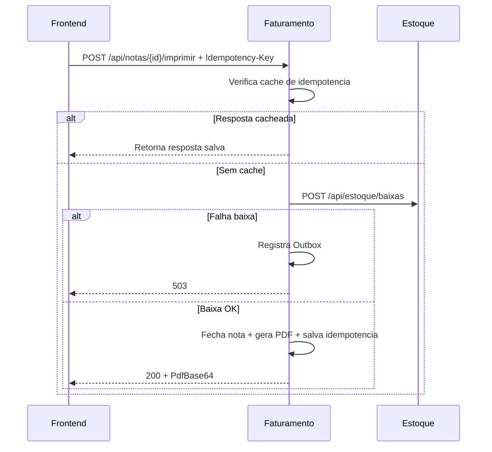

# Fluxos de negocio e integracao

## 1. Fluxo de produtos

### Criar produto

1. Frontend envia `POST /api/produtos` para Estoque.
2. API normaliza codigo/descricao e verifica codigo existente.
3. Se ja existir ativo: retorna `409`.
4. Se existir inativo: reativa e atualiza dados.
5. Se nao existir: cria novo e retorna `201`.

### Editar produto

1. Frontend envia `PUT /api/produtos/{id}`.
2. API atualiza campos principais e marca como ativo.
3. Retorna produto atualizado.

### Excluir produto

1. Frontend envia `DELETE /api/produtos/{id}`.
2. API aplica exclusao logica (`Ativo = false`).
3. Retorna `204`.

## 2. Fluxo de nota fiscal

### Criar nota

1. Frontend monta itens da nota e envia `POST /api/notas`.
2. Faturamento calcula `NumeroSequencial` com base no maior numero existente.
3. Nota e criada com status inicial `Aberta`.
4. Itens sao persistidos junto da nota.

### Imprimir nota (fluxo principal)

1. Frontend gera UUID e envia `POST /api/notas/{id}/imprimir` com header `Idempotency-Key`.
2. Faturamento valida header e consulta cache de idempotencia (`chave + endpoint`).
3. Se existir cache: retorna a resposta persistida.
4. Se nao existir:
   - valida existencia da nota;
   - valida status `Aberta`.
5. Faturamento monta payload de baixa e chama Estoque (`POST /api/estoque/baixas`).
6. Se baixa falhar:
   - registra evento em outbox;
   - retorna `503` com mensagem amigavel;
   - nota permanece `Aberta`.
7. Se baixa tiver sucesso:
   - altera nota para `Fechada`;
   - gera PDF;
   - salva resposta em `IdempotencyRequests`;
   - retorna `200` com PDF em base64.

## 3. Fluxo de baixa de estoque

1. Estoque recebe `POST /api/estoque/baixas` com itens da nota.
2. Valida lote com ao menos um item e quantidade positiva.
3. Para cada item:
   - valida produto existente;
   - valida saldo suficiente;
   - decrementa saldo;
   - incrementa token de versao.
4. Salva tudo em transacao.
5. Em conflito de concorrencia (EF): retorna `409`.

## 4. Fluxo de falha entre microsservicos

Caso tipico: Estoque indisponivel no momento da impressao.

1. Frontend solicita impressao.
2. Faturamento tenta baixar estoque.
3. Chamada falha.
4. Faturamento responde `503`.
5. Nota nao e fechada.
6. Falha fica rastreavel em `OutboxMessages`.

## 5. Fluxo de idempotencia

1. Cliente envia uma `Idempotency-Key` por tentativa logica.
2. Faturamento salva resposta de sucesso associada a `chave + endpoint`.
3. Repeticoes com a mesma chave devolvem o mesmo payload sem novos efeitos colaterais.

## Diagrama do fluxo de impressao

